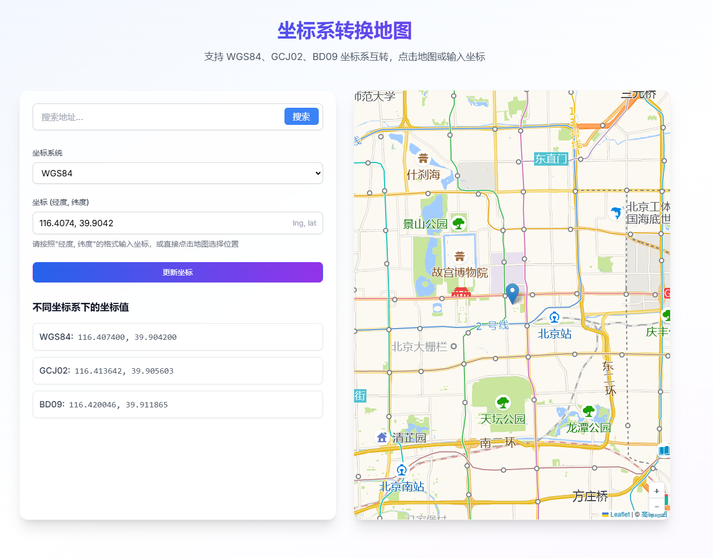

# Map View 地图视图应用

这是一个基于 Next.js 开发的地图视图应用，集成了高德地图服务。

🌐 [在线演示](https://map-view-rosy.vercel.app/)  [](https://map-view-rosy.vercel.app/)



## 环境配置

1. 克隆项目后，首先复制环境变量模板文件：

```bash
cp .env.example .env
```

2. 在 `.env` 文件中配置高德地图 API Key：

```bash
NEXT_PUBLIC_AMAP_KEY=你的高德地图API Key
```

> 注意：如果没有配置 API Key，应用仍然可以运行，但地图相关功能将无法正常使用。

## 开发说明

1. 安装依赖：

```bash
npm install
# 或
yarn install
# 或
pnpm install
```

2. 启动开发服务器：

```bash
npm run dev
# 或
yarn dev
# 或
pnpm dev
```

3. 在浏览器中打开 [http://localhost:3000](http://localhost:3000) 查看应用。

## 技术栈

- Next.js
- TypeScript
- 高德地图 Web 服务 API

## 主要功能

- 地理编码：支持地址搜索并返回经纬度信息
- 更多功能开发中...

## 项目结构

```
src/
  ├── utils/
  │   └── geocodeUtils.ts  # 地理编码工具函数
  └── ...

## Deploy on Vercel

The easiest way to deploy your Next.js app is to use the [Vercel Platform](https://vercel.com/new?utm_medium=default-template&filter=next.js&utm_source=create-next-app&utm_campaign=create-next-app-readme) from the creators of Next.js.

Check out our [Next.js deployment documentation](https://nextjs.org/docs/app/building-your-application/deploying) for more details.
